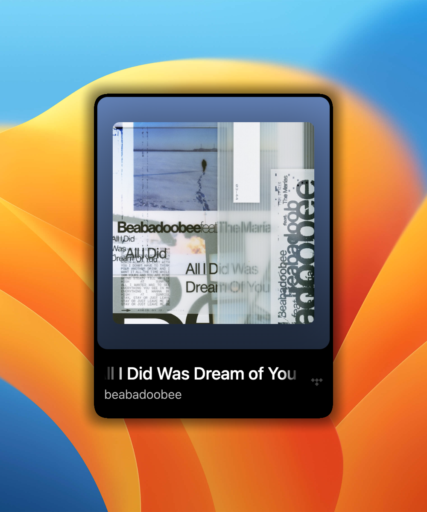
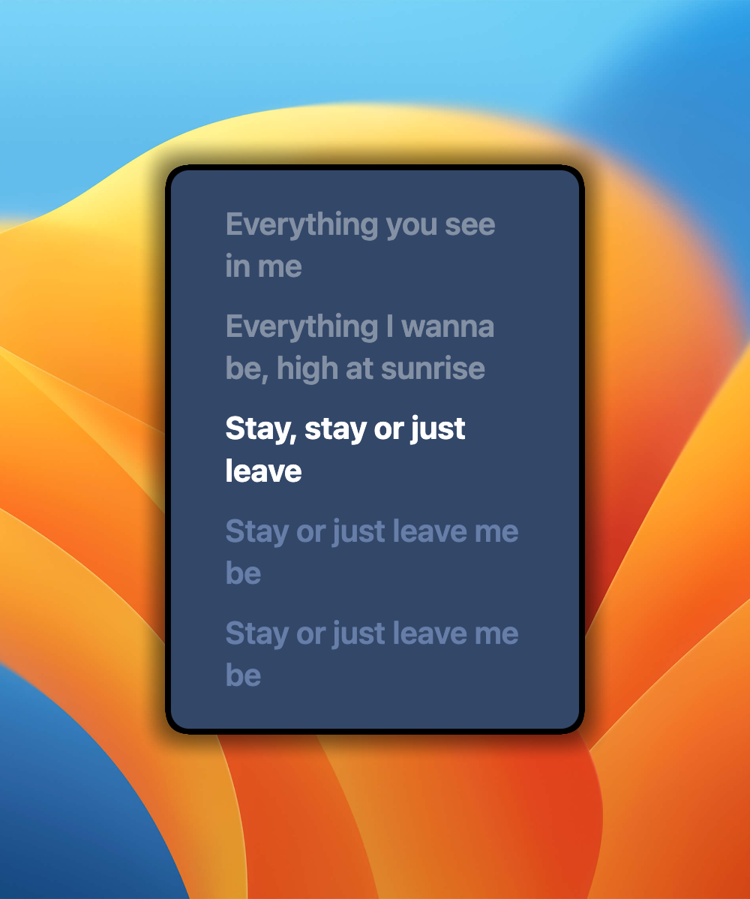

# OpenKaraoke

A tiny always-on-top karaoke lyrics overlay for macOS. Works with any music app — Tidal, Spotify, Apple Music, whatever. No login required.


<p align="center">
  
  &nbsp;&nbsp;
  
</p>

## How it works

OpenKaraoke reads what's playing on your Mac using the system's now-playing API (the same one that powers Control Center). It grabs the track info, fetches synced lyrics, and displays them in a floating overlay with real-time karaoke highlighting.

## Features

- Synced lyrics via [LrcLib](https://lrclib.net) with multi-result search + [Genius](https://genius.com) fallback
- Karaoke mode with dynamic album art color theming
- Playback controls — play/pause, prev, next, seek (controls your actual music app)
- Album art fetched automatically via iTunes Search API
- Japanese, Korean, and Chinese romanization
- Draggable, resizable, always-on-top frameless window
- Works with any app that shows up in macOS Now Playing

## Setup

```bash
git clone https://github.com/judekim0507/OpenKaraoke.git
cd OpenKaraoke
npm install
npm start
```

That's it. Play a song in any music app and lyrics show up automatically.

## Requirements

- macOS (uses private MediaRemote framework)
- [Node.js](https://nodejs.org) v18+

## Keyboard shortcuts

- **T** — open timing helper (for manually syncing lyrics)
