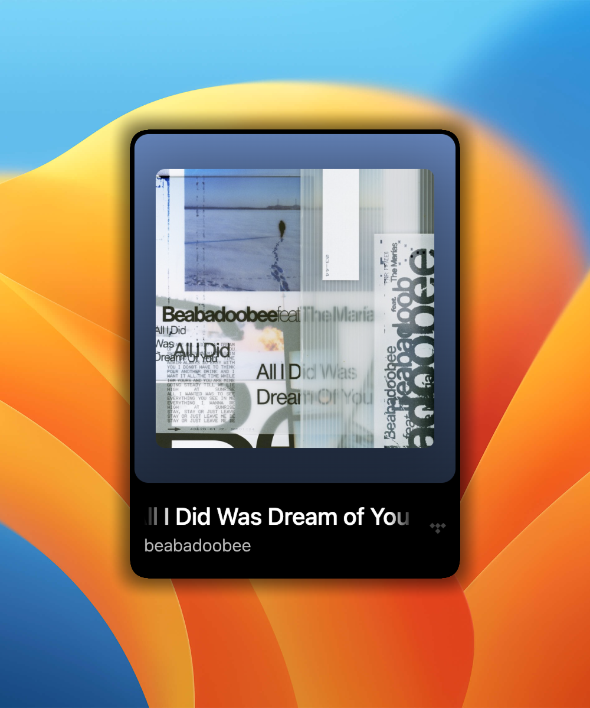
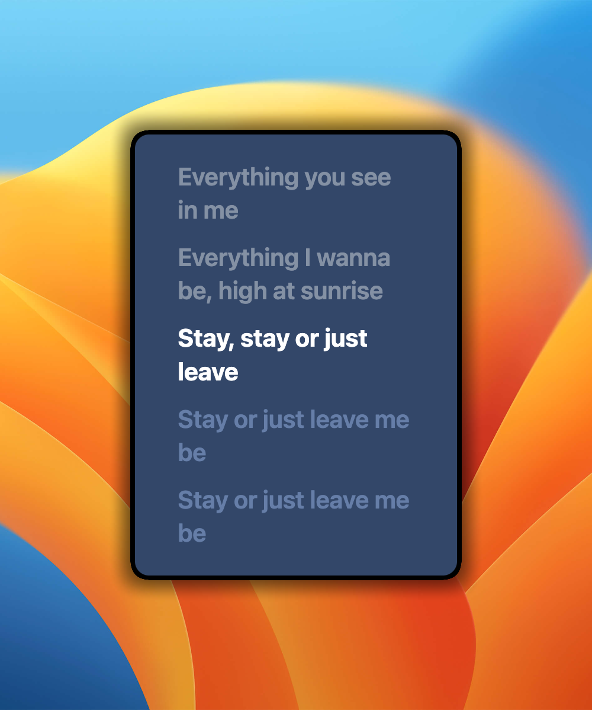

# OpenKaraoke

A tiny always-on-top karaoke lyrics overlay for macOS. Works with any music app — Tidal, Spotify, Apple Music, whatever. No login required.


<p align="center">
  
  &nbsp;&nbsp;
  
</p>

## How it works

OpenKaraoke reads what's playing on your Mac using the system's now-playing API (the same one that powers Control Center). It grabs the track info, fetches synced lyrics, and displays them in a floating overlay with Apple Music-style word-by-word highlighting.

## Features

- Syllable-synced lyrics via [Unison](https://unison.betterlyrics.org/docs) (Better Lyrics' community TTML database) and [lrc.red](https://lrc.red), falling back to line-synced [LrcLib](https://lrclib.net) and then [Genius](https://genius.com)
- Apple Music-style lyrics UI and animation powered by [am-lyrics](https://github.com/binimum/am-lyrics): syllable wipes, background vocals, duet alignment, blur on inactive lines, instrumental-break dots
- SF Pro typography throughout
- Karaoke mode with dynamic album art color theming
- **Fullscreen mode** — Apple Music-style split view with album art, controls, and lyrics with edge fade
- Playback controls — play/pause, prev, next, seek (controls your actual music app via system media keys)
- Click any lyric line to seek to that timestamp
- Album art fetched automatically via iTunes Search API
- Japanese, Korean, and Chinese romanization (shown under each line; translation toggle in fullscreen)
- Draggable, resizable, always-on-top frameless window
- **Menu bar tray icon** — hidden from Dock and Cmd+Tab, lives quietly in the menu bar
- Source app detection with icons (Tidal, Spotify, Apple Music, etc.)
- Auto-hiding cursor and controls in fullscreen
- Works with any app that shows up in macOS Now Playing

## Setup

```bash
git clone https://github.com/judekim0507/OpenKaraoke.git
cd OpenKaraoke
npm install
npm start
```

That's it. Play a song in any music app and lyrics show up automatically.

Or grab the latest `.dmg` from [Releases](https://github.com/judekim0507/OpenKaraoke/releases).

## Requirements

- macOS (uses private MediaRemote framework)
- [Node.js](https://nodejs.org) v18+ (for development)

## Keyboard shortcuts

- **T** — open timing helper (for manually syncing lyrics)
- **Esc** — exit fullscreen

## Credits

- [am-lyrics](https://github.com/binimum/am-lyrics) by uimaxbai: lyrics UI and animation, used unmodified under [MPL-2.0](https://www.mozilla.org/en-US/MPL/2.0/)
- Lyrics from [Unison](https://unison.betterlyrics.org), [lrc.red](https://lrc.red), [LrcLib](https://lrclib.net), and [Genius](https://genius.com)
